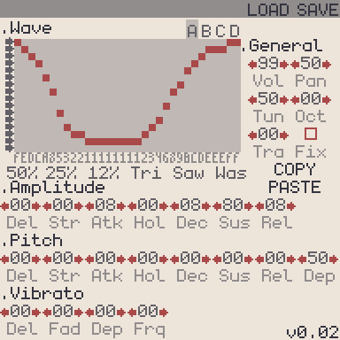

# BitSFZ

**BitSFZ** is a toy program to generate simple wavetable chiptune `.sfz` instruments, which can be played with a compatible player.

There are up to 4 layers (ABCD) avaliable, which can produce either a 32x16 wave or random noise (with 15 different variations). There are controls for volume and pitch envelopes as well as vibrato. The file is updated live as things are changed.
